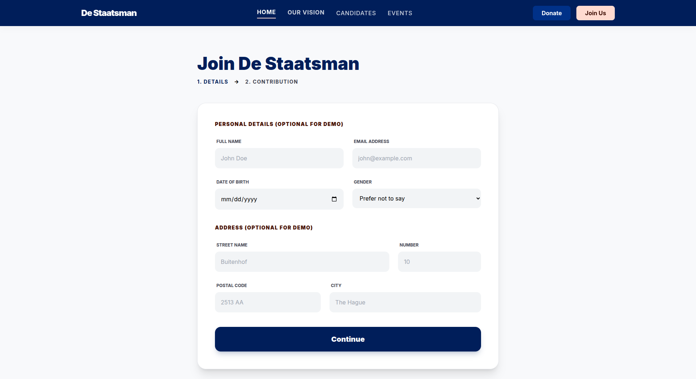
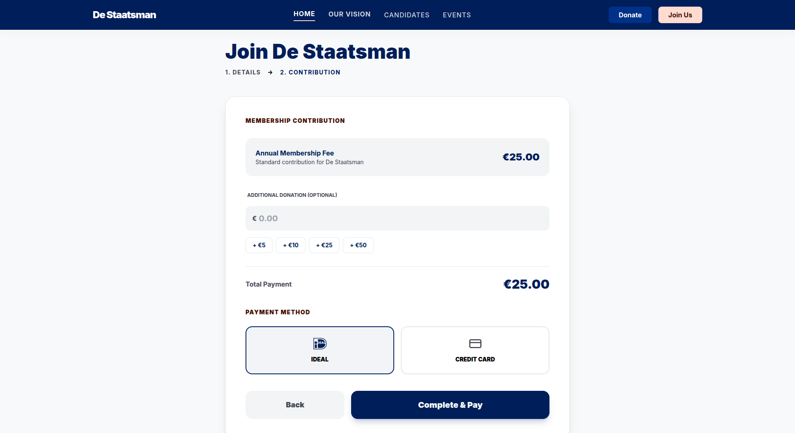
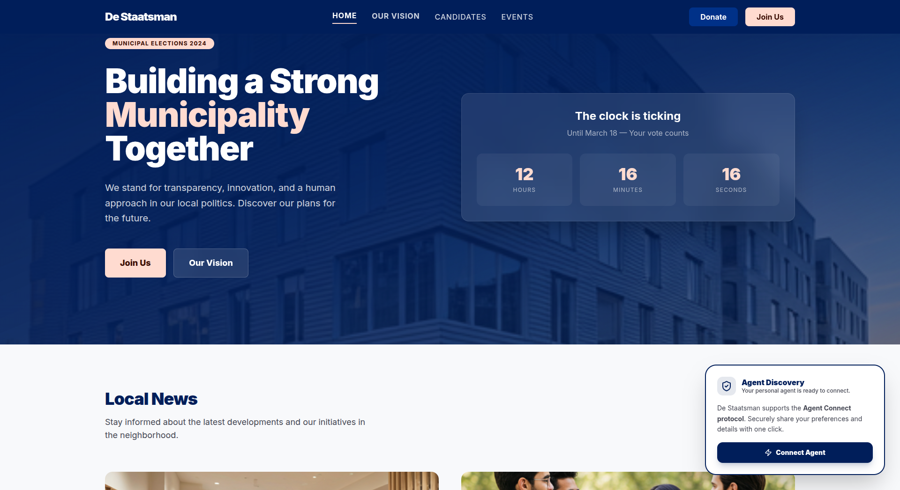

# Agent Connect

An AI trust layer that puts you in control of your personal data. Agent Connect stores your data in a personal memory bank, lets you share it with websites on your own terms, and gives you a single dashboard to see and revoke exactly what you've shared — and for what purpose. The result is a more personalized web, less repetitive form-filling, and genuine GDPR compliance built into the interaction itself.

## The Problem

Every time you sign up for a new service, you fill in the same fields: name, address, date of birth, payment method. The website stores a copy and uses it however it likes. You have no visibility into what data is held where, what it is used for, or how to take it back. Meanwhile, the website gets a bare minimum of information because long forms have low completion rates — so both sides lose.

On top of this, GDPR requires organisations to collect data for a specific, stated purpose and not reuse it for something else. In practice, users consent to vague privacy policies they never read, and organisations have no clean way to demonstrate per-field, per-purpose consent.

## The Solution

Agent Connect is a Chrome extension that acts as your personal data agent. Your data lives in your agent — not scattered across dozens of websites. When you visit a site that supports Agent Connect, it tells your agent what data it needs and why. You review the request, choose exactly which fields to share, and confirm. The site receives the data, personalizes your experience immediately, and the interaction is logged in your permissions dashboard with the stated purpose attached.

You stay in control: you can see every field shared with every site and revoke any of it at any time. Websites get richer, more accurate data because sharing is frictionless. And the consent record — with explicit per-field purposes — is exactly what GDPR requires.

---

## User Flows

### Without the Extension — The Normal Flow

When a user visits **De Staatsman** (a demo political party website) and clicks **Join Us**, they go through a standard two-step signup:

**Step 1 — Personal Details**

The user fills in their full name, email address, date of birth, gender, and home address manually.



**Step 2 — Membership Contribution**

The user selects an annual membership fee (€25.00), optionally adds a donation, picks a payment method (iDEAL or Credit Card), and clicks **Complete & Pay**.



---

### With the Extension — The Agent Connect Flow

When the extension is installed, the De Staatsman website detects it and shows an **Agent Discovery** widget in the corner, signalling that the Agent Connect protocol is available.



The user clicks **Connect Agent**. The extension opens a consent popup showing exactly which data fields the website is requesting — Name, Demographics, Political Affiliation, and Address — each with a toggle to include or exclude it. Each field states the purpose it will be used for. The user selects what they want to share and clicks **Share Selected**. The website immediately receives the data and can personalize the experience — no form to fill in, no manual entry.


For the payment step, a compact **AP2 Payment Mandate** popup appears directly in the extension. It shows the merchant, line items, and total. The user reviews it and signs with one click — no card details entered on the website.


---

### Managing Permissions

At any time the user can open the extension's **Permissions** page to see every site they have shared data with, what fields were shared, and when. Each entry has a **Revoke All & Delete** button to instantly withdraw consent and remove the stored data.


---

## Why is this the top pick for the hackathon?

Agent Connect is a **progressive improvement** — it makes things better for every party involved, without requiring anyone to rip out their existing setup.

**Users get a personalized web without giving up control.** With Agent Connect, websites can greet you by name, pre-fill your preferences, and tailor content to your profile — the same kind of personalization that today requires handing over your data permanently. Here, the data stays in your agent. You choose what to share each time, and you can take it back. No more filling in the same fields on every new site, and no more wondering what a company is doing with your information.

**Websites get richer, more accurate data.** Long forms have low completion rates — users skip optional fields and abandon flows entirely. Because sharing through Agent Connect is a single click, users are far more willing to share demographics, preferences, and other fields they would never bother typing. Sites get higher completion rates and better data quality, which directly improves personalization and targeting.

**Data ownership moves to the user.** Today your data is scattered across every service you have ever signed up for, with no way to see it all or reclaim it. Agent Connect flips this: your data lives in your agent, and websites receive a share — not a permanent copy. The permissions dashboard is a single place to see every field shared with every service, and revoking it is one button press.

**It is purpose-built for GDPR compliance.** GDPR does not just require consent — it requires *purpose limitation*: data collected for one reason cannot be silently reused for another. Agent Connect surfaces the stated purpose of every data request at the moment of consent (e.g. "campaign optimization and member management"), records it alongside the permission, and keeps it visible in the dashboard. This gives users a clear picture of what their data is being used for, and gives organisations a transparent, auditable consent record that maps directly onto GDPR's core requirements — without any extra compliance tooling.

---

## Protocols

Agent Connect is built on three open protocols that together cover the full lifecycle of an agent-mediated interaction.

### A2A — Agent-to-Agent

A2A is the **server-to-server messaging protocol**. It defines how agents discover each other and exchange structured capability requests.

A website that supports Agent Connect publishes an agent manifest at `/.well-known/agent.json`. This manifest lists the site's capabilities (e.g. `membership_application`) and the endpoints the user's agent can call. When the Chrome extension detects this file, it reads the manifest and the user's server agent can begin sending A2A messages to the website agent.

In this app:
- `packages/server-website/public/.well-known/agent.json` — the De Staatsman website publishes its capabilities here
- `packages/server-agent/` — the user's agent receives and responds to A2A messages
- `packages/user-agent/src/client.ts` — the client that sends capability requests to remote A2A endpoints

### A2UI — Agent-to-UI

A2UI is the **dynamic UI protocol**. Instead of hardcoding consent forms in the extension, agents send a serialized tree of UI component definitions at runtime. The extension renders whatever the agent describes.

When the user initiates a flow, the user agent responds with an A2UI payload — a list of typed component definitions such as `DataRequestItem` (a toggleable data field), `NestedDataRequestItem` (a collapsible group of sub-fields), and `SectionHeader`. The extension's `A2UIRenderer` walks this tree and renders the consent UI dynamically. As the user toggles fields on and off, the state is sent back to the agent, which can respond with an updated A2UI tree.

This means the extension never needs to know what fields a particular website requests — the agent decides and describes them at runtime.

In this app:
- `packages/dummy-user-agent/src/index.ts` — generates A2UI component trees (Name, Demographics, Political Affiliation, Address toggles)
- `packages/chrome-extension/src/components/A2UIRenderer.tsx` — recursively renders the component tree
- `packages/chrome-extension/src/components/Chat.tsx` — receives A2UI updates from the agent and passes them to the renderer

### AP2 — Agent Payment Protocol

AP2 is the **payment authorization protocol**. Rather than the user filling in payment details on the website, the website agent sends a signed payment mandate to the user's agent. The user reviews the mandate — merchant name, line items, total — and authorizes it with a single **Sign & Pay** action. The agent's wallet signs the mandate and the payment is processed.

This removes payment details from the website entirely: the site never sees a card number or bank account. The mandate is shown in a compact popup inside the extension, replacing the multi-field payment form the user would otherwise complete on the website.

In this app:
- `packages/chrome-extension/src/components/Payment.tsx` — renders the AP2 payment mandate UI
- The mandate is triggered when the user agent sets `triggerPayment: true` in an A2A response, switching the extension from the A2UI consent view to the AP2 payment view

### How the protocols fit together

```
Website publishes /.well-known/agent.json
        ↓  (A2A discovery)
Extension reads manifest, user's agent connects
        ↓  (A2A capability request)
User agent generates consent form
        ↓  (A2UI — component tree sent to extension)
Extension renders toggleable data fields
        ↓  (user selects fields, confirms)
User agent prepares payment mandate
        ↓  (AP2 — mandate sent to extension)
User reviews and signs with one click
        ↓  (AP2 authorization)
Transaction complete, permissions stored
```

---

## Architecture

The project is structured as a monorepo. The packages split cleanly across two sides: the **De Staatsman side** (the organisation) and the **user side**.

**De Staatsman side**

| Package | Description |
|---|---|
| `packages/server-website` | The De Staatsman website — demo political party site that implements the Agent Connect protocol and shows the Agent Discovery widget |
| `packages/server-agent` | The De Staatsman server agent — handles incoming A2A messages, exposes capabilities like `membership_application`, and acts on behalf of the organisation |

**User side**

| Package | Description |
|---|---|
| `packages/chrome-extension` | The Chrome extension — the user's interface for reviewing data requests, managing consent, and authorising payments |
| `packages/user-agent` | The user's agent — the extension communicates with this agent, which holds the user's personal data and negotiates with the website's server agent over A2A |
| `packages/dummy-user-agent` | A simplified stand-in for the user agent used during development, generating hardcoded A2UI component trees |

The website and server agent act on behalf of **De Staatsman**. The extension and user agent act on behalf of the **user**. The two sides communicate exclusively through the A2A, A2UI, and AP2 protocols — neither side has direct access to the other's internals.

## Getting Started

Install dependencies from the repo root:

```bash
yarn install
```

Start the website:

```bash
yarn workspace website dev
```

Build the Chrome extension:

```bash
yarn workspace chrome-extension build
```

Then load the unpacked extension from `packages/chrome-extension/build/chrome-mv3-dev` in Chrome (`chrome://extensions` → **Load unpacked**).
